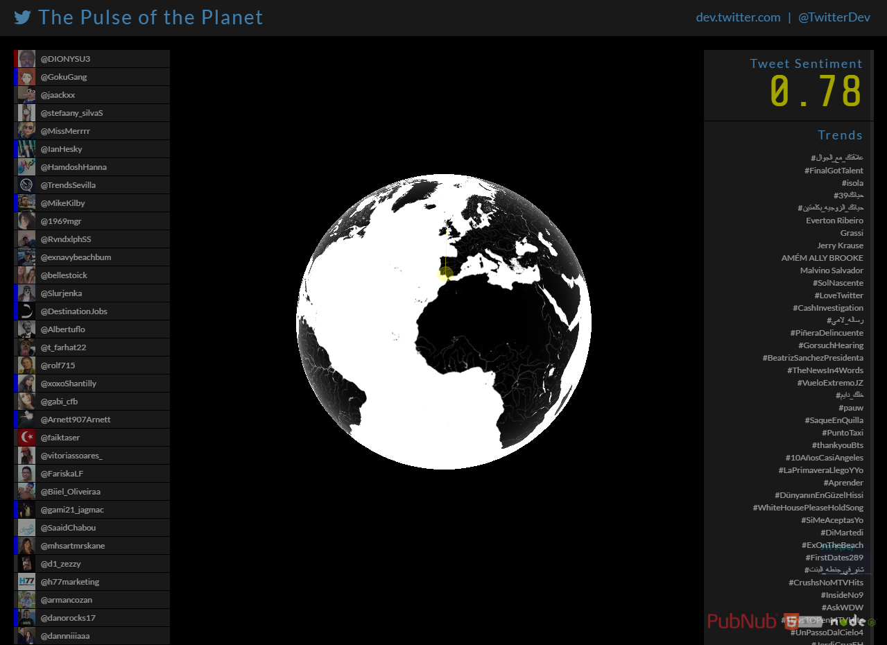

# ΙΟΝΙΟ ΠΑΝΕΠΙΣΤΗΜΙΟ

# ΤΜΗΜΑ ΠΛΗΡΟΦΟΡΙΚΗΣ

## ΙΩΑΝΝΗΣ ΑΓΓΕΛΗΣ 
## Α.Μ Π2015006

# ΜΑΘΗΜΑ
## Κινητά και Κοινωνικά Μέσα

# Επιλογή Εργασίας
## Sentiment Analysis on Twitter

## Παραδοτέο 1
### Παρεμβάσεις στα χρώματα:

Μπλε : το συναίσθημα της εμπιστοσύνης ,
Πράσινο : το συναίσθημα της ασφάλειας ,
Κίτρινο : το συναίσθημα της ευτυχίας ,
Κόκκινο : το συναίσθημα του θυμού.

Τα χρώματα μπορεί να αλλάξουν κατά την πορεία υλοποίησης της εργασίας.

### Λέξεις που θα μεταφραστούν:

accept,accepted,accidents,afraid,agreement,alive,alone,angry,bad,battle,
beautify,brave,cheat,clarifies,clarity,clash,clear,damage,danger,easy,
enemy,enjoy,error,exciting,fails,useful,ability,capability,visionary,yes.	

## Παραδοτέο 2

### Διεύθυνση εφαρμογής

https://cscwtweteer.herokuapp.com/

### Αλλαγές που έγιναν
Τα χρώματα αλλάχτηκαν όπως δηλώθηκε στο Παραδοτέο 1 με μερικές προσθέσεις και μικρές αλλαγές.  Δηλαδή

Πράσινο : το συναίσθημα της εμπιστοσύνης ,
Μπλε : το συναίσθημα της ασφάλειας ,
Κίτρινο : το συναίσθημα της ευτυχίας ,
Γκρι :  : το συναίσθημα της θλίψης  , 
Κόκκινο : το συναίσθημα του θυμού, 
Έντονο Κόκκινο : το συναίσθημα της οργής.

Εκτός από την αλλαγή χρώματος στις ακτίνες έγινε αλλαγή και στα όρια του φίλτρου για τα χρώματα  των συναισθημάτων .  Δηλαδή οριστήκαν νέες τιμές για την απόδοση  των συναισθημάτων (Στο μέλλον ενδέχεται να αλλάξουν ) .
### Αναλυτικά
 tweet.sentiment.score  <=  -0.80  Συναίσθημα της οργής
 
tweet.sentiment.score  <=  -0.40 &&  tweet.sentiment.score  >  -0.80  Συναίσθημα του θυμού

tweet.sentiment.score  < -0.40 &&  tweet.sentiment.score  >  0  Συναίσθημα της θλίψη

tweet.sentiment.score   >=   0  &&  tweet.sentiment.score  <  0.40     Συναίσθημα της ευτυχίας

tweet.sentiment.score  >=  0,40 && tweet.sentiment.score  < 0.80   Συναίσθημα της εμπιστοσύνης

tweet.sentiment.score  >=  0.80   Συναίσθημα της ασφάλειας

### Λέξεις που μεταφράστηκαν
Ability  = ικανότητα , accept = αποδέχομαι ,  accepted  = αποδεκτό ,  accidents  = ατυχήματα, afraid	= φοβισμένος ,  agreement = συμφωνία ,enemy = εχθρός ,  alive =  ζωντανός ,  alone = μόνος ,  angry = θυμωμένος ,  bad = κακό , battle = μάχη , beautify = καλλωπίζω , brave = γενναίος , capability =  δυνατότητα ,  cheat =  απάτη  ,  clarifies = διασαφηνίζει ,  clarity = σαφήνεια ,  clash  = σύγκρουση ,  clear = Σαφή , damage = ζημιά ,  danger = κίνδυνος ,  easy = εύκολο , enjoy  = απολαμβάνω,error = λάθος , exciting	 = συναρπαστικός ,  fails = αποτυγχάνει  ,  trusted = έμπιστος ,useful = χρήσιμος , visionary = ονειροπόλος , yes = ναί .

https://github.com/GIANNIS-AGGELIS/twitter-stream-globe/blob/METAFLASH_LEXEON/AFINN-translateToGreek165.txt

https://github.com/GIANNIS-AGGELIS/twitter-stream-globe/blob/Colors-Tests/public/javascripts/TweetBeacon.js

## Παραδοτέο 3

Όλα τα επιτυχημένα commit που γίνανε στο branch develop δημιουργώ αντίστοιχα καινούρια   branch  με τα καταλληλά ονόματα   ώστε να φαίνεται οι κάθε αλλαγές  μεμονωμένες και ξεχωριστά.  

Αλλάχτηκαν τα χρώματα στα tweets των ανθρώπων με μπλε τα θετικά χρώματα  και έντονο κόκκινο τα αρνητικά. Παρακάτω το αντιστοιχώ link .

 https://github.com/GIANNIS-AGGELIS/twitter-stream-globe/commits/Twette-Color-Change/public/stylesheets
 
Έγινε αλλαγή στην ταχύτητα και στη φορά της   υδρογείου . Η ταχύτητα αυξήθηκε   και η περιστροφή της γης γίνεται προς τα αριστερά.  Παρακάτω το αντιστοιχώ link .

https://github.com/GIANNIS-AGGELIS/twitter-stream-globe/commits/EARTH-SPEED/public/javascripts

Έγινε αλλαγή στο μέγεθος της υδρογείου . Το μέγεθος  της το  μίκρυνα αρκετά.  Παρακάτω το αντιστοιχώ link .

https://github.com/GIANNIS-AGGELIS/twitter-stream-globe/commits/SIZE-GLOBE/public/javascripts

Έγινε περιορισμός των δεδομένων από τα tweets σε ολόκληρη την  Ευρώπη.  Το μόνο που χριζότανε ήταν αν μετατρέψεις της  γεωγραφικές συντεταγμένες από το  GOOGLE EARTH σε συντεταμένες GPS χρησιμοποιώντας το  itouchmap .Και στη συνείχα να αλλάξεις τον κώδικα που εμφανίζει τα tweets .Παρακάτω το αντίστοιχα links .

https://itouchmap.com/latlong.html
https://github.com/GIANNIS-AGGELIS/twitter-stream-globe/commits/TWEETS-LOCATION/public/javascripts

Τέλος έγινε αλλαγή στην οπτικοποίηση  της υδρογείου έγινε  προσθέτοντας μια εικόνα στον φάκελο με τις εικόνες και αλλάζοντας στο αρχείο  TwitterStreamGlobe.js την εικόνα που θα φόρτωση . Παρακάτω το αντιστοιχώ link .

https://github.com/GIANNIS-AGGELIS/twitter-stream-globe/commits/VISUALIZATION-WORLD/public

Όλα τα παραπάνω ξεχωριστά  commits  αντιπροσωπεύουν το develop  και η υλοποίηση της εφαρμογής στο herocu  γίνεται μέσα από αυτό το branch .

## Διεύθυνση εφαρμογής

https://cscwtweteer.herokuapp.com/
