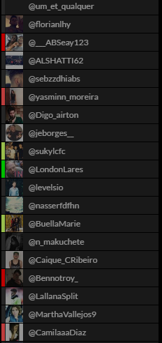
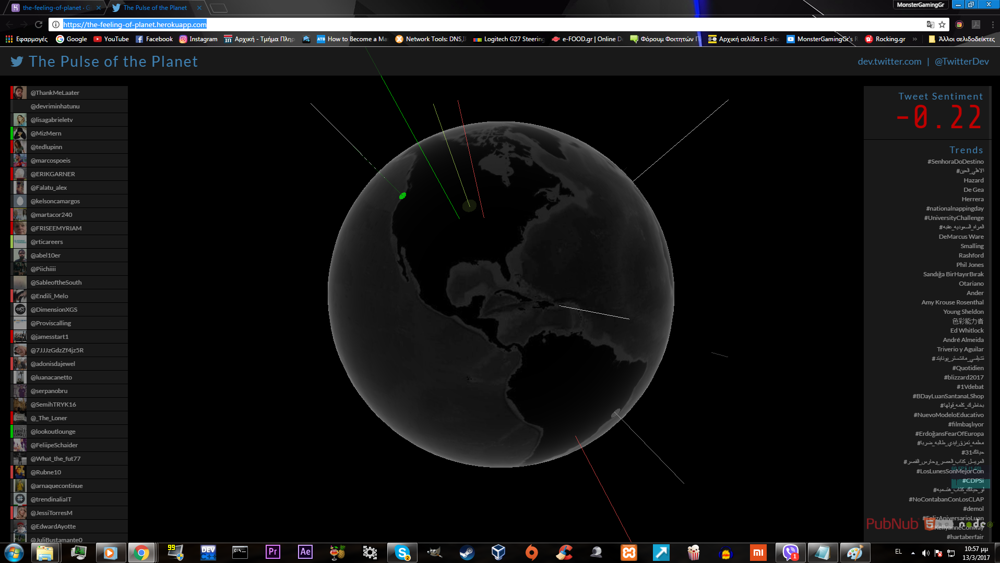

# ΙΟΝΙΟ ΠΑΝΕΠΙΣΤΗΜΙΟ </br></br>


# ΤΜΗΜΑ ΠΛΗΡΟΦΟΡΙΚΗΣ </br></br>


# ΜΑΘΗΜΑ
## Κινητά και Κοινωνικά Μέσα</br>
 
Επιβλέπων καθηγητής: Χωριανόπουλος Κωνσταντίνος </br></br></br>


# Επιλογή Εργασίας
## Sentiment Analysis on Twitter

Μανώλης Τασιόπουλος</br>
ΑΜ: Π2015046</br></br></br>

## Παραδοτέο 1</br>
### Παρεμβάσεις στα χρώματα:</br>

* Έντονα θετικό συναίσθημα: Πρασινο

* Θετικό συναίσθημα: λαχανι

* Αρνητικό συναίσθημα: ροζ

* Έντονα αρνητικό συναίσθημα: Κόκκινο

</br>
### Λέξεις που θα μεταφραστούν: </br>
</br>
violated,victories,unwanted,unhealthy,unfunnyunforgiving,sweet,supporter,accessible,clever,crime,dead,cute,delay,healthyhopes,ignore,lag,likes,loving,mistakes,noob,overload,prison,rich,scary,shy,solve,stops,swift,threaten,trap,worn,wrongly

##Παραδοτέο 2

###Link της εφαρμογής : https://the-feeling-of-planet.herokuapp.com/

-Το branch που χρησιμοποιήθηκε είναι το τελικό branch που περιέχει αλλαγές που έχουν γίνει στα χρώματα τόσο στην υδρόγειο όσο και στην αριστερή στήλη με τα ονόματα των χρηστών

####Αλλαγές στον κώδικα: 
  - Τα χρώματα άλλαξαν σε αυτά τα οποία αναφερθήκαν στο πρώτο παραδοτέο τόσο στην υδρόγειο όσο και στην αριστερή στήλη που απεικονίζετε η διάθεση των διάφορων χρηστών του twitter
  - Προκειμένου να δημιουργηθούν τέσσερα χρώματα τα οποία υποδηλώνουν τη διάθεση των χρηστών προστεθήκαν εντολές if στον κωδικά java script με τις έξης συνθήκες :

   * Πολύ αρνητικό συναίσθημα - (συναίσθημα <= -2)   
   * αρνητικό συναίσθημα - (-2 < συναίσθημα < 0)
   * θετικό συναίσθημα - (0 < συναίσθημα < 2)
   * Πολύ θετικό συναίσθημα - (συναίσθημα > 2)
   
  !Η τιμή 2 επιλέχθηκε με βάση το αρχείο AFINN-translateToGreek165.txt στο οποίο το ποιο θετικό συναίσθημα είναι το 5 και το ποιο αρνητικό το -5. Ετσι επιλέχθηκε το 2 ως ενδιάμεση τιμή
  
####Screenshots: 



```
αλλαγή χρώματος των χρηστών με βάση τα συναισθήματα τους
```



```
Τελικό αποτέλεσμα
```

### Μετάφραση λέξεων: 

  - Αγγλικά: violated,victories,unwanted,unhealthy,unfunny,unforgiving,sweet,supporter,
            accessible,clever,crime,dead,cute,delay,healthy,hopes,ignore,lag,likes,loving,
            mistakes,noob,overload,prison,rich,scary,shy,solve,stops,swift,threaten,trap,worn,wrongly

  - Ελληνικά: παραβιάζονται, νίκες, ανεπιθύμητη, ανθυγιεινά, Μη κωμικός, συγχωρεί, γλυκό, υποστηρικτής, προσιτή, 
             έξυπνος, εγκλημα, νεκρός, χαριτωμένο, καθυστέρηση, υγιή, ελπίδες, αγνοώ, υστερούν, 
             αρέσει, αγάπη, λάθη, αρχάριος, υπερφόρτωση, φυλακή, πλούσιος, τρομακτικό, ντροπαλός, λύση,
             στάσεις, ταχεία, απειλούν, παγίδα, φθαρμένα, λανθασμένα

##Παραδοτέο 3
</br>

##Παραδοτέο 4
</br>


