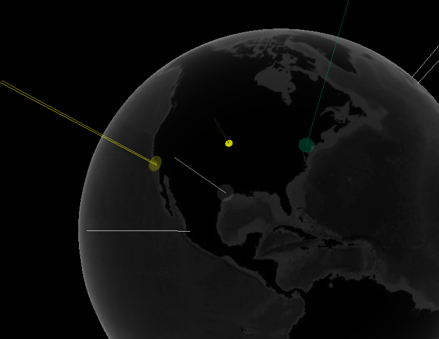

# ΙΟΝΙΟ ΠΑΝΕΠΙΣΤΗΜΙΟ  
# ΤΜΗΜΑ ΠΛΗΡΟΦΟΡΙΚΗΣ  

## Κινητά και Κοινωνικά Μέσα  
Επιβλέπων καθηγητής: Χωριανόπουλος Κωνσταντίνος

## Sentiment Analysis on Twitter  
__Φοιτητής:__ Γιορντάνωβ Ντάνιελ  
__ΑΜ:__ Π2015105

# Παραδοτέο 1  
## Παρεμβάσεις στα χρώματα:

- Έντονο αρνητικό συναίσθημα: Κόκκινο  
- Αρνητικό συναίσθημα: Πορτοκαλί  
- Θετικό συναίσθημα: Κίτρινο  
- Έντονο θετικό συναίσθημα: Πράσινο

## Λέξεις που θα μεταφραστούν:  
adopt  
demanding  
liar  
luck  
mad  
mindless  
miracle  
mistake  
moaning  
murderer  
myth  
negativity  
noticeable  
odd  
opportunity  
outstanding  
overjoyed  
pollution  
pray  
pressure  
proud  
racist  
scar  
selfishness  
short-sighted  
skeptic  
smarter  
strength  
tears  
trap  

# Παραδοτέο 2
## Διεύθυνση (URL) της εφαρμογής  
https://pacific-atoll-58486.herokuapp.com  
## Μεταφρασμένες λέξεις  
adopt = υιοθετώ ενστερίζομαι  
demanding = απαιτητικός απαιτητική απαιτητικό  
liar = ψεύτης ψεύτρα  
luck = τύχη  
mad = τρελός τρελή παλαβός παλαβή  
mindless = αδιάφορος αδιάφορη  
miracle = θαύμα  
mistake = λάθος σφάλμα  
moaning = βογγώ  
murderer = δολοφόνος  
myth = μύθος  
negativity = αρνητικότητα  
noticeable = αξιοσημείωτος αξιοσημείωτη αξιοσημείωτο αισθητός αισθητή αισθητό  
odd = περίεργος περίεργη περίεργο αλλόκοτος αλλόκοτη αλλόκοτο  
opportunity = ευκαιρία  
outstanding = εξαιρετικός εξαιρετική εξαιρετικό  
overjoyed = περιχαρής καταχαρούμενος καταχαρούμενη καταχαρούμενο  
pollution = ρύπανση μόλυνση  
pray = προσεύχομαι  
pressure = πίεση  
proud = περήφανος περήφανη περήφανο  
racist = ρατσιστής ρατσίστρια  
scar = ουλή  
selfishness = εγωιστικότητα  
short-sighted = κοντόφθαλμος  
skeptic = σκεπτικός σκεπτική σκεπτικιστής  
smarter = εξυπνότερος εξυπνότερη εξυπνότερο εξυπνότερα  
strength = δύναμη ισχύς  
tears = δάκρυα κλάματα  
trap = παγίδα  

* Όπου κρίθηκε απαραίτητο, οι λέξεις μεταφράστηκαν με περισσότερες από μία λέξη.  
  
**Link στο αρχείο του forked repo:**   https://github.com/danielyor/twitter-stream-globe/blob/develop/AFINN-translateToGreek165.txt  
## Αλλαγές σε κώδικα για διαβάθμιση συναισθημάτων  
Έγινε επεξεργασία του αρχείου TweetBeacon.js για την αλλαγή χρωμάτων των ακτίνων, όπως ορίστηκε στο Παραδοτέο 1. Στις γράμμες όπου έγιναν οι αλλαγές προστέθηκαν και σχόλια (γραμμές 20-35).  
Μια ακόμα μικρή αλλαγή έγινε στο πάχος της ακτίνας (γραμμή 57).  
https://github.com/danielyor/twitter-stream-globe/blob/lightbeamcolors/public/javascripts/TweetBeacon.js  

Στιγμιότυπο για 3 από τα 5 χρώματα ακτινών:  
  
*"Πράσινο για έντονο θετικό συναίσθημα, κίτρινο για θετικό συναίσθημα, και άσπρο για ουδέτερο συναίσθημα."*

# Παραδοτέο 3  

### Υδρόγειος:  
- Έγινε αλλαγή της υφής της υδρογείου με νέα εικόνα. Εκτός από άποψη αισθητικής, ο χρήστης μπορεί επίσης να ξεχωρίσει τις μεγάλες πόλεις πάνω στον χάρτη. (Link στο αρχείο: https://github.com/danielyor/twitter-stream-globe/blob/limit-location-feed/public/images/earth-new-night.jpg )  
- Μειώθηκε η ταχύτητα περιστροφής στο περίπου κατα το ήμισυ. (Γραμμή 166: https://github.com/danielyor/twitter-stream-globe/blob/limit-location-feed/public/javascripts/TwitterStreamGlobe.js )  
- Η γεωγραφική προέλευση των tweets περιορίστηκε στο βόρειο ημισφαίριο. (Γραμμές 26-39: https://github.com/danielyor/twitter-stream-globe/blob/limit-location-feed/public/javascripts/TweetHud.js )
- Επίσης μετακινήθηκε η κάμερα πιο ψηλά και πιο κοντά, ώστε να δωθεί παραπάνω έμφαση στο βόρειο ημισφαίριο. (Γραμμές 7-8: https://github.com/danielyor/twitter-stream-globe/blob/limit-location-feed/public/javascripts/TwitterStreamGlobe.js)

### Διορθώσεις σε προηγούμενες αλλαγές:
- Έγιναν παρεμβάσεις στα CSS αρχεία ώστε οι αλλαγές των χρωμάτων των ακτινών να εφαρμοστούν και στο Hud της εφαρμογής (Tweets στα αριστερά και Tweet Sentinent πάνω δεξιά. Link: https://github.com/danielyor/twitter-stream-globe/tree/limit-location-feed/public/stylesheets )

## Στιμιότυπα

Η νέα υδρόγειος και θέση της κάμερας:  

Η αλλαγές στα χρώματα του Hud:  

## Διεύθυνση (URL) της εφαρμογής
https://pacific-atoll-58486.herokuapp.com  

