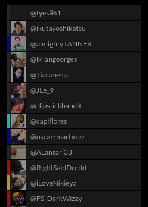
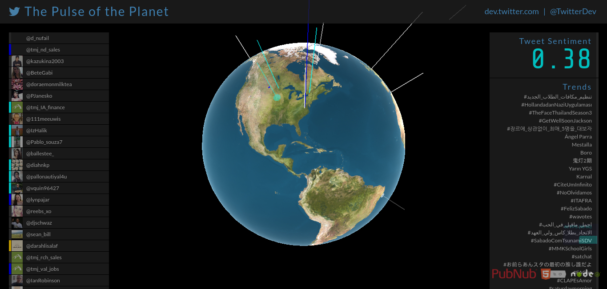
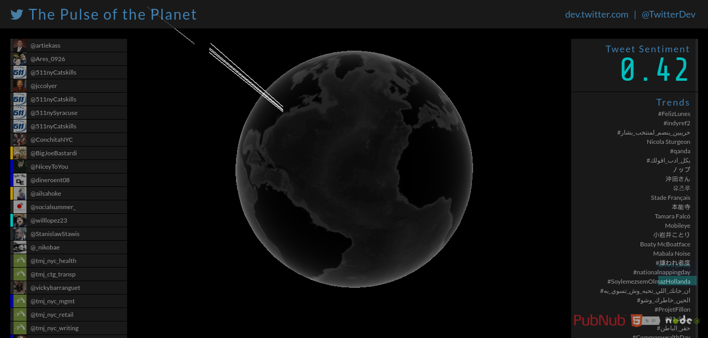

# Ιόνιο Πανεπιστήμιο

# Τμήμα Πληροφορικής

## Κινητά και Κοινωνικά Μέσα

## Twitter Sentiment Analysis

## Γιώργος Μαργαρίτης ΑΜ Π2015139

## Παραδοτέο 1

### Διαβαθμίσεις χρωμάτων

* Έντονα θετικό συναίσθημα: Μπλε

* Θετικό συναίσθημα: Γαλάζιο

* Αρνητικό συναίσθημα: Πορτοκαλί

* Έντονα αρνητικό συναίσθημα: Κόκκινο

### Λέξεις που θα μεταφραστούν

abusing, abusive, destroy, selfish, terror, torture, trauma, treason, terrorist, terrorists, unbelievable, undecided, unemployment, unemployed, unfair, wrong, sweet, supporter, support, solve, solution, solutions, smart, secure, praise, popular, popularity, pleasure, pleasurable, joy, joyful, impressed

**Θα γίνει αλλαγή στην υφή της υδρογείου**

**Θα μειωθεί η ταχύτητα περιστροφής της**

**Θα περιοριστεί η περιοχή προέλευσης των tweets**

**Ενδέχεται να υπάρξουν περαιτέρω αλλαγές για καλύτερη βαθμολόγηση**

## Παραδοτέο 2

### Διεύθυνση για την εφαρμογή
https://radiant-bastion-22660.herokuapp.com/

Η προσθήκη των keys , tokens έγινε απευθείας στο heroku οπότε δε χρειάστηκε αλλαγή του index.js

### Υλοποιήθηκε η διαβάθμηση των χρωμάτων όπως δηλώθηκε στο Παραδοτέο 1

* Έντονα θετικό συναίσθημα: Μπλε

* Θετικό συναίσθημα: Γαλάζιο

* Αρνητικό συναίσθημα: Πορτοκαλί

* Έντονα αρνητικό συναίσθημα: Κόκκινο

**Η διαβάθμηση έγινε ως εξής:**

2 < Έντονα θετικό συναίσθημα

0 < Θετικό συναίσθημα <= 2

-2 <= Αρνητικό συναίσθημα < 0

Έντονα αρνητικό συναίσθημα < -2

**Link:** [TweetBeacon.js](https://github.com/gmargaritis/twitter-stream-globe/blob/%CE%A0%CE%B1%CF%81%CE%B1%CE%B4%CE%BF%CF%84%CE%AD%CE%BF-2-/-%CE%91%CE%BB%CE%BB%CE%B1%CE%B3%CE%AE-%CE%A7%CF%81%CF%89%CE%BC%CE%AC%CF%84%CF%89%CE%BD/public/javascripts/TweetBeacon.js)

### Πραγματοποιήθηκε αλλαγή αντστοίχων χρωμάτων στην αριστερή στήλη και στο score

**Links:**
* [TweetHud.js](https://github.com/gmargaritis/twitter-stream-globe/blob/%CE%A0%CE%B1%CF%81%CE%B1%CE%B4%CE%BF%CF%84%CE%AD%CE%BF-2-/-%CE%91%CE%BB%CE%BB%CE%B1%CE%B3%CE%AE-%CE%A7%CF%81%CF%89%CE%BC%CE%AC%CF%84%CF%89%CE%BD/public/javascripts/TweetHud.js)

* [style.css](https://github.com/gmargaritis/twitter-stream-globe/blob/%CE%A0%CE%B1%CF%81%CE%B1%CE%B4%CE%BF%CF%84%CE%AD%CE%BF-2-/-%CE%91%CE%BB%CE%BB%CE%B1%CE%B3%CE%AE-%CE%A7%CF%81%CF%89%CE%BC%CE%AC%CF%84%CF%89%CE%BD/public/stylesheets/style.css)

* [style.scss](https://github.com/gmargaritis/twitter-stream-globe/blob/%CE%A0%CE%B1%CF%81%CE%B1%CE%B4%CE%BF%CF%84%CE%AD%CE%BF-2-/-%CE%91%CE%BB%CE%BB%CE%B1%CE%B3%CE%AE-%CE%A7%CF%81%CF%89%CE%BC%CE%AC%CF%84%CF%89%CE%BD/public/stylesheets/style.scss)

### Λέξεις που μεταφράστηκαν

abusing (καταχρώμαι), abusive (καταχρηστικός , καταχρηστική), destroy (καταστρέφω), selfish (εγωιστής , εγωίστρια), terror (τρόμος), torture (βασανηστήριο), trauma (τραύμα), treason (προδοσία), terrorist (τρομοκράτης), terrorists (τρομοκράτες), unbelievable (απίστευτο), undecided (αναποφάσιστος , αναποφάσιστη), unemployment (ανεργία), unemployed (άνεργος , άνεργη), unfair (άδικο), wrong (λανθασμένος , λανθασμένη), sweet (γλυκός , γλυκιά , γλυκό), supporter (υποστηρικτής), support (υποστηρίζω), solve (λύνω), solution (λύση), solutions (λύσεις), smart (έξυπνος , έξυπνη , έξυπνο), secure (ασφαλής), praise (έπαινος), popular (δημοφιλής), popularity (δημοτικότητα), pleasure (ευχαρίστηση), pleasurable (απολαυστικός , απολαυστική , απολαυστικό), joy (χαρά), joyful (χαρούμενος , χαρούμενη), impressed (εντυπωσιασμένος , εντυπωσιασμένη)

**Link:** [AFINN-translateToGreek165.txt](https://github.com/gmargaritis/twitter-stream-globe/blob/%CE%A0%CE%B1%CF%81%CE%B1%CE%B4%CE%BF%CF%84%CE%AD%CE%BF-2-/-%CE%9C%CE%B5%CF%84%CE%AC%CF%86%CF%81%CE%B1%CF%83%CE%B7-%CE%9B%CE%AD%CE%BE%CE%B5%CF%89%CE%BD/AFINN-translateToGreek165.txt)

## Παραδοτέο 3

### Διεύθυνση για την εφαρμογή

Δημιουργήθηκε το brach Final που περιέχει όλες τις μέχρι στιγμής αλλαγές.

https://radiant-bastion-22660.herokuapp.com/

Τα branch στα οποία πραγματοποιήθηκαν οι αλλαγές *προήλθαν* απο το branch που είχε γίνει η αλλαγή των χρωμάτων.

### Επιτεύχθηκε αλλαγή στην υφή της υδρογείου

Προστέθηκε μια εικόνα της υδρογείου στο /public/images και έπειτα τέθηκε το σωστό path στο αρχείο TwitterStreamGlobe.js

**Links:**

* [TwitterStreamGlobe.js](https://github.com/gmargaritis/twitter-stream-globe/blob/61c6d682cffbec2dc1baf2a8784bbe31b83b5d38/public/javascripts/TwitterStreamGlobe.js#L61)

* [/public/images](https://github.com/gmargaritis/twitter-stream-globe/blob/%CE%A0%CE%B1%CF%81%CE%B1%CE%B4%CE%BF%CF%84%CE%AD%CE%BF-3-/-%CE%91%CE%BB%CE%BB%CE%B1%CE%B3%CE%AE-%CE%A5%CF%86%CE%AE%CF%82/public/images/world-map.jpg)

### Επιτεύχθηκε η μείωση της ταχύτητας της υδρογείου

**Link:** [TwitterStreamGlobe.js](https://github.com/gmargaritis/twitter-stream-globe/blob/218817a2964262d8f79c478c4b7480bd608852f9/public/javascripts/TwitterStreamGlobe.js#L166)

### Επιτεύχθηκε o περιορισμός της περιοχής προέλευσης των tweets

Έγινε αλλαγή στα longitude, latitude ζευγάρια σύμφωνα με το twitter API [1] ώστε τα εισαρχόμενα tweets να προέρχονται μόνο από τη Νέα Υόρκη.

**Link:** [tweet-publisher/index.js](https://github.com/gmargaritis/twitter-stream-globe/blob/c7fb37ad94b8a61d3c6dbeca4dfd5063e98c6083/tweet-publisher/index.js#L36)

## Βιβλιογραφία

[1]: [Twitter API / Streaming API request parameters / Locations](https://dev.twitter.com/streaming/overview/request-parameters#locations)
