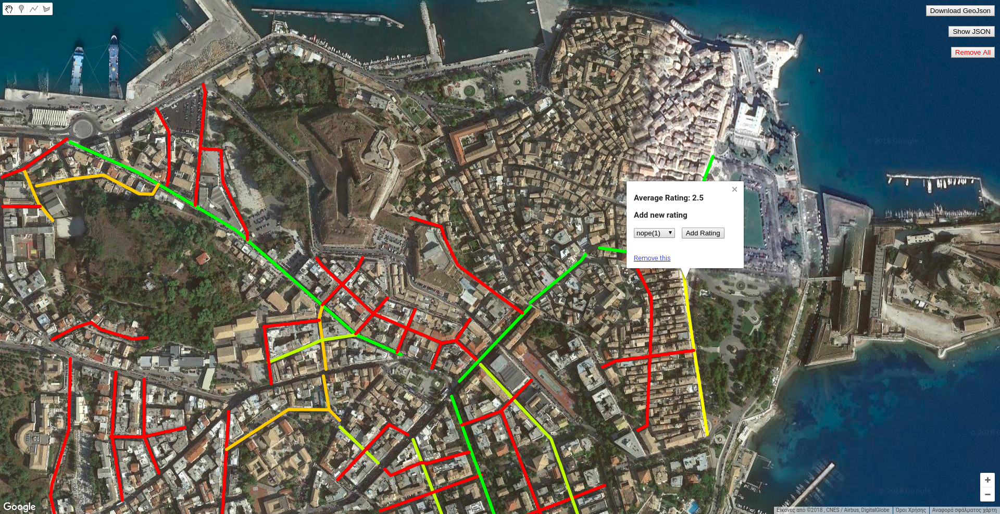

Μαθημα: Κινητά και Κοινωνικά Μέσα

Ασλανωβ Χριστοφορος
Π2016071

https://chr314.github.io/corfu-map/

https://github.com/chr314/corfu-map

παραδοτεο 1

το συστημα των βαθμολογιων επιτρεπει να προστεθουν πολλες βαθμολογιες για το καθε σχημα και μετα διχνει τον μεσο ορο.
το χρωμα του σχηματος εξαρτατε απο τον μεσο ορο, 0(κοκκινο) - 5(πρασινο) οπου 0 οταν δεν υπαρχει βαθμολογια

κανοντας κλικ πανο σε καποιο απο σχημα εμφανιζετε ενα popup το οποιο διχνει το μεσο ορο των βαθμολογιων για το συγκεκριμενο σχημα(στη περιπτωση μας για εναν δρομο), δινει την δυνατοτητα να προσθεσει ο χρηστης νεα βαθμολογια και στο κατω μερος υπαρχει ενας συνδεσμος που διαγραφει το σχημα.

στα δεξια υπαρχουν 3 κουμπια, το ενα ειναι για να γινει ληψη του αρχειου geojson το αλλο ειναι για να εμφανιζετε και να εξαφανιζετε το κειμνο με το geojson και το αλλο ειναι για να διαγραφει ολα τα σχηματα 
